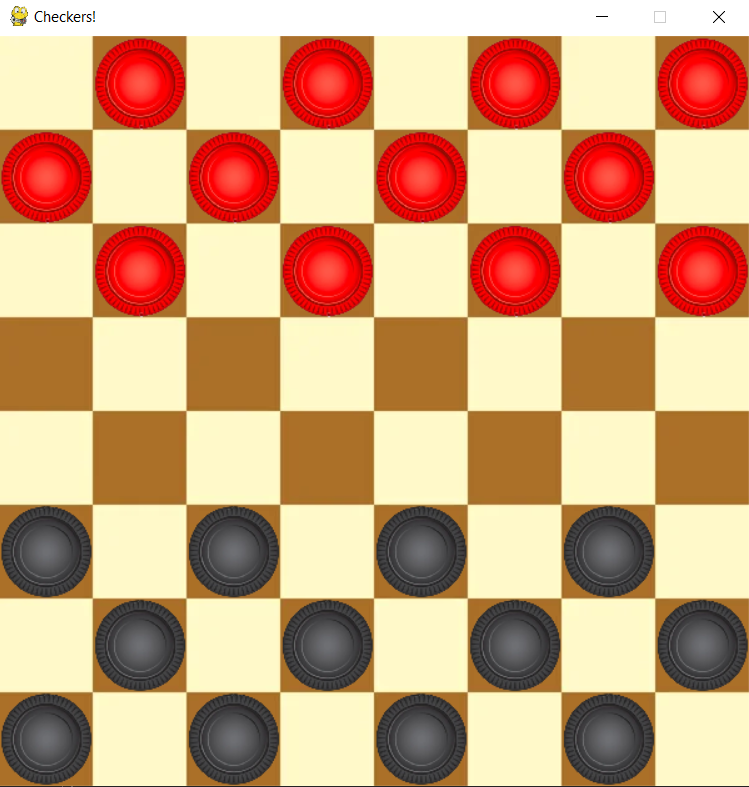

# AI_Project_Checkers


---

## 1.Installation

### 1.1 Clone the repository
```bash
git clone https://github.com/RaoGhulam/checkers.git
cd checkers
```

### 1.2 Create and activate a virtual environment (optional but recommended)
```bash
# Create a virtual environment
python -m venv venv

# Activate the virtual environment
# Linux/macOS
source venv/bin/activate

# Windows
# venv\Scripts\activate
```

### 1.3 Install dependencies
```bash
pip install -r requirements.txt
```
---

## 2. Introduction
This report outlines the development of an 8×8 Checkers game featuring:

- Forced multiple jumps (mandatory capture moves)
- Minimax algorithm for AI decision-making
- Alpha-beta pruning for optimization
- Custom evaluation function with weighted heuristics
- Pygame UI for interactive gameplay

---

## 3. Game Rules & Features
### 3.1. Standard Checkers Rules
- Played on an 8×8 board.
- Pieces move diagonally forward.
- Forced captures: If a player can capture an opponent's piece, they must do so.
- Multiple jumps: If a piece can make consecutive captures in one turn, it must.
- King promotion: A piece reaching the opponent's back row becomes a king (can move backward).
- Win condition: The game ends when one player has no valid moves (either by losing all pieces or being blocked).

### 3.2. AI Enhancements
- Minimax Algorithm: Evaluates possible moves up to a certain depth.
- Alpha-Beta Pruning: Optimizes minimax by cutting off irrelevant branches.
- Evaluation Function: Uses weighted heuristics to assess board states.

---

## 4. AI Implementation
### 4.1. Minimax Algorithm
- Recursive depth-based search to explore possible moves.
- Maximizes AI score while minimizing player score.
- Depth limitation for performance (typically 3-5 moves ahead).

### 4.2. Alpha-Beta Pruning
- Reduces computation time by eliminating branches that cannot influence the final decision.
- Alpha (best already explored for maximizer).
- Beta (best already explored for minimizer).

### 4.3 Evaluation Function Implementation

The AI's decision-making is driven by a sophisticated evaluation function that analyzes 11 key game factors with carefully tuned weights.

#### Core Piece Valuation
- **Pawn** = 100 points  
- **King** = 160 points (60% more valuable than pawns)

#### Positional Analysis Components

| Heuristic            | Weight | Calculation Method |
|----------------------|--------|--------------------|
| Material Advantage   | 1.0    | Direct piece count with king premium |
| Mobility            | 0.4    | Legal moves × (8 for kings/5 for pawns) |
| Center Control      | 0.3    | Bonus for pieces in central 4×4 zone (12pts kings/8pts pawns) |
| Promotion Potential | 0.3    | Distance to promotion row × 4 |
| King Safety         | 0.4    | +15 for kings on back rank |
| Threat Detection    | 0.6    | +10 per capturable enemy piece |
| Multi-Jump Potential | 0.5   | +10 per possible consecutive jump |
| Vulnerability       | 0.6    | -15 for exposed pieces without backup |
| Piece Clustering    | 0.3    | +2 per adjacent friendly piece |
| Edge Safety        | 0.2    | +6 for pieces on board edges |
| Tempo Advantage    | 0.25   | Progressive advancement toward promotion |

#### Key Implementation Features

1. **Dual-Sided Evaluation**: Scores both player and opponent positions
2. **Position-Sensitive Bonuses**: Different values for kings vs pawns
3. **Threat Detection**: Actively searches for jump sequences
4. **Dynamic Weighting**: Combines factors via:
   ```python
   total_score = sum(weights[key] * score[key] for key in score)

---

## 5. Pygame UI Implementation
- Click-to-move piece selection and movement.
- Highlighting of valid moves.
- Visual distinction between normal pieces and kings.
- Game state display (turn, winner, captures).

---

## 6. Conclusion
This Checkers implementation combines:  
✔ Classic rules (forced captures, kings).  
✔ Advanced AI (minimax + alpha-beta + evaluation function).  
✔ User-friendly Pygame UI (click-based interaction).  

Future Improvements:  
- Machine learning for adaptive AI.  
- Multiplayer networking support.  
- Enhanced visual effects.  
